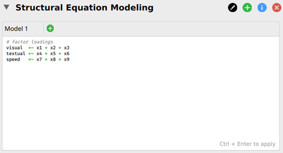
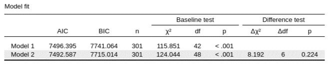

<span class="section-badge advanced">Advanced Topics</span>

Measurement invariance (MI) testing asks whether the **measurement model** of a questionnaire or test behaves the same way across groups — different cultures, sexes, age cohorts, clinical groups, or repeated time points. It is a prerequisite for almost any meaningful between-group comparison of a latent construct: a difference in observed mean scores is only interpretable as a difference on the underlying construct if the items measure that construct equivalently in both groups.

This page builds on the [Factor Analysis](factor-analysis.qmd) page — invariance testing uses **multi-group CFA**, so you'll want to be comfortable with CFA first.

---

## What is the question?

Suppose you administer a 5-item depression scale to a Dutch sample and a UK sample, and want to compare mean depression scores. Before you can interpret a 0.4-point difference as "the Dutch are more depressed", you need to rule out competing explanations such as:

- Do the five items load on the **same** factor in both samples? (Maybe one item taps something other than depression in the Dutch version)
- Do they load to the **same degree**? (Maybe one item is a stronger indicator of depression in one group than in the other)
- Are there **systematic offsets** in how each group responds to specific items, independent of their true level on the construct? (Maybe a translation makes one item read more strongly in one language)

MI testing addresses each of these as a nested hierarchy of CFA models. If a given level holds, you've ruled out one class of confound and can move on to the next.

---

## The hierarchy of invariance

Following Meredith (1993) and Vandenberg & Lance (2000), MI is tested as a step-up sequence of increasingly restrictive multi-group CFA models. Brown (2015, Ch 7) and others recommend the descriptive pedagogical names alongside the technical labels:

| Level | What is constrained equal across groups | What it allows you to compare |
|---|---|---|
| **Configural** ("equal form") | Same factor structure (which items load on which factors) — but loadings, intercepts, and residuals all freely estimated | The qualitative pattern of the construct |
| **Metric** ("equal factor loadings", weak factorial) | Configural + factor loadings (λ) | Relationships involving the factor (correlations, regressions, interactions with other variables) |
| **Scalar** ("equal intercepts", strong factorial) | Metric + indicator intercepts (τ) | **Latent means** — the headline thing you usually want |
| **Strict** ("equal residual variances", strict factorial) | Scalar + indicator residual variances (θ) | Sometimes required for very strict comparisons of observed score reliability across groups; rarely tested in practice |

::: {.callout-tip}
## Why the hierarchy is ordered this way
Each step rests on the previous one. You can only compare relationships between factors if loadings are equal (metric); you can only compare latent means if intercepts are also equal (scalar). If scalar invariance fails for some items, you can sometimes proceed with **partial invariance** (see below).
:::

---

## Recommended sequence (Brown, 2015, p. 243)

1. Fit the CFA model **separately in each group** — make sure the basic measurement model fits in each before trying to test invariance.
2. **Configural model** — fit the multi-group CFA with the same factor structure but no equality constraints. This is the baseline.
3. **Metric model** — constrain factor loadings equal across groups. Compare to configural via a nested χ² test (or ΔCFI / ΔRMSEA — see below).
4. **Scalar model** — additionally constrain intercepts equal. Compare to metric.
5. **Strict model** *(optional)* — additionally constrain residual variances equal. Compare to scalar.

If scalar invariance holds, you may then proceed to *substantive* group comparisons:

6. Test equality of **factor variances** across groups (do the groups differ in how much they vary on the construct?).
7. Test equality of **factor covariances** *(if >1 factor)* (do the inter-factor relationships differ?).
8. Test equality of **latent means** (this is the question you usually want to answer).

Steps 2–5 are tests of **measurement invariance** (do the items work the same?). Steps 6–8 are tests of **population heterogeneity** (do the groups differ on the construct itself?).

---

## How to judge each step

Brown (2015, §"Reliance on χ²") notes that the literature uses two kinds of criteria, and most applied papers report both:

### Nested χ² difference test
The traditional method. The constrained model has more degrees of freedom; if adding the constraints produces a *significant* increase in χ² relative to the less-constrained model, the constraint is rejected and you have noninvariance.

**Limitation**: χ² is extremely sensitive to sample size. With large *N*, even trivial group differences will produce a significant Δχ², and you'll reject invariance for substantively meaningless reasons.

### Practical fit-index thresholds
Cheung & Rensvold (2002) and Meade, Johnson & Braddy (2008) proposed cut-offs based on Monte Carlo simulations of how much CFI should drop under "true" noninvariance. Common practical rules of thumb:

| Criterion | Suggested cutoff for "invariance holds" |
|---|---|
| ΔCFI | ≤ .01 (Cheung & Rensvold, 2002) — or ≤ .002 (Meade et al., 2008, more conservative) |
| ΔRMSEA | ≤ .015 (Chen, 2007) |
| ΔSRMR | ≤ .030 (Chen, 2007) for metric; ≤ .015 for scalar |

Report both Δχ² *and* practical-fit changes. When they disagree (Δχ² significant but ΔCFI < .01), the standard interpretation is that the χ² is being driven by sample size and the substantive impact is small — but document this transparently.

---

## Partial invariance

If a step fails for **all** items, the level of invariance is rejected and you can't proceed. But if it fails because of **one or two specific items**, you can sometimes still make group comparisons by freeing the constraint just on those items — this is **partial invariance** (Byrne, Shavelson & Muthén, 1989).

**How to find non-invariant parameters**: inspect **modification indices** for the constrained parameters. A large MI on an intercept (for example) means freeing that constraint would meaningfully improve fit. The standard workflow:

1. Identify the parameter with the largest MI.
2. Free it. Re-test. If fit is now acceptable, that parameter is the source of the noninvariance.
3. Repeat if necessary, but be conservative — freeing too many parameters undermines the meaning of the comparison.

::: {.callout-warning}
## How much partial invariance is too much?
A common rule of thumb: at least **two indicators per factor** must remain invariant for latent-mean comparisons to be defensible. Beyond that, the literature is mixed — see Putnick & Bornstein (2016) for current reporting conventions.
:::

---

## MIMIC modeling: a more parsimonious alternative

When you have many groups and a complex factor model, full multi-group CFA can become unwieldy. **MIMIC** (Multiple Indicators Multiple Causes) is an alternative that codes group membership as a covariate (dummy variable) in a single-group CFA:

- A significant **direct effect of the dummy code on the latent factor** indicates a group difference on the latent mean (population heterogeneity).
- A significant **direct effect of the dummy code on an indicator** indicates measurement noninvariance on that intercept (differential item functioning).

MIMIC is more parsimonious and works well with many groups or small samples, but it can only test two of the four sources of invariance (intercepts and factor means — not loadings or residuals). For full invariance testing, multi-group CFA remains the gold standard (Brown, 2015, §"CFA in Multiple Groups").

---

## How to do it in JASP

JASP's **SEM** module wraps `lavaan` and supports multi-group CFA with parameter constraints expressed directly in lavaan syntax. The workflow below follows the JASP-blog tutorial by van Kesteren & Koch (2022), which uses the Holzinger & Swineford (1939) three-factor mental-abilities dataset (nine items grouped into Visual, Textual, and Speed factors) compared across two schools (Pasteur vs Grant-White).

### 1. Specify the base CFA model

Open the **SEM** analysis. In the *Multigroup SEM* tab at the bottom of the input panel, drag the grouping variable (e.g. `school`) into the *Group* box. In the *Model Options* tab, tick **Include mean structure** so that intercepts will be estimated (required for scalar invariance later). Then enter the configural model syntax in the top input box:

```r
visual  =~ x1 + x2 + x3
textual =~ x4 + x5 + x6
speed   =~ x7 + x8 + x9
```

{fig-align="center" width=560}

Press **Ctrl+Enter** to fit the model. JASP estimates this configural model separately in each group (all parameters free).

{fig-align="center" width=420}

### 2. Add the metric model with constrained loadings

Click the green **+** next to "Model 1" to add a *Model 2*. To constrain factor loadings equal across groups, **label** each loading with a `name*item` prefix — identical labels are interpreted by lavaan as equality constraints across groups:

```r
visual  =~ v1*x1 + v2*x2 + v3*x3
textual =~ t1*x4 + t2*x5 + t3*x6
speed   =~ s1*x7 + s2*x8 + s3*x9
```

Press Ctrl+Enter again. JASP now fits Model 2 alongside Model 1 and reports a **model-comparison table** with χ², df, ΔCFI, AIC/BIC, and the χ² difference test:

{fig-align="center" width=620}

### 3. Add the scalar model with constrained intercepts

Click **+** again to add a *Model 3*. In addition to the labelled loadings, label the **indicator intercepts** explicitly (the `~ i*1` syntax constrains the intercept of each indicator equal across groups):

```r
visual  =~ v1*x1 + v2*x2 + v3*x3
textual =~ t1*x4 + t2*x5 + t3*x6
speed   =~ s1*x7 + s2*x8 + s3*x9
x1 ~ i1*1
x2 ~ i2*1
x3 ~ i3*1
x4 ~ i4*1
x5 ~ i5*1
x6 ~ i6*1
x7 ~ i7*1
x8 ~ i8*1
x9 ~ i9*1
```

The model-comparison table now compares all three nested models in one place:

{fig-align="center" width=620}

::: {.callout-tip}
## Why type the constraints by hand?
JASP exposes "Constrain loadings / intercepts / residual variances equal across groups" as click-boxes in the point-and-click interface — but using them, you cannot produce the nested model-comparison table with χ² difference tests shown above. The labelled-syntax workflow gives you the formal invariance test in one click.
:::

For automated MI testing across the configural → metric → scalar → strict sequence outside JASP, the standard R tool is `semTools::measEq.syntax()` (or, for quick exploration, `semTools::measurementInvariance()` in older versions). Results from R can be reported alongside the JASP fit output.

→ **Full tutorial**: [van Kesteren, E.-J., & Koch, M. (2022). Measurement invariance testing using the SEM module in JASP](https://jasp-stats.org/2022/01/25/measurement-invariance-testing-using-the-structural-equation-modeling-sem-module-in-jasp/) — JASP blog. Walks through the worked example above end to end.

---

## Reporting

::: {.callout-tip}
## Reporting MI testing
Following Putnick & Bornstein (2016), state:

1. The **grouping variable** and **groups**, with sample sizes per group.
2. The **base CFA model** that was fit in each group (which items, which factors), with fit indices per group.
3. A **fit table** with one row per nested model (configural, metric, scalar, [strict]). Columns: χ², df, *p*, CFI, RMSEA, SRMR, Δχ²/Δdf relative to the previous step, *p* of Δχ², ΔCFI, ΔRMSEA.
4. **Decision** at each step (invariant or not), and any parameters freed for partial invariance.
5. **Substantive interpretation** of any latent-mean differences at the end of the sequence.

Example sentence: "Configural invariance held (CFI = .968, RMSEA = .041). Imposing equal loadings did not significantly worsen fit (Δχ²(4) = 5.21, *p* = .27, ΔCFI = .001), supporting metric invariance. Imposing equal intercepts produced a significant Δχ² (Δχ²(4) = 22.4, *p* < .001) but a small change in CFI (ΔCFI = .005). One item (item 3) showed a large modification index; freeing its intercept restored fit and supported partial scalar invariance."
:::

---

## Further reading

- **Brown, T. A. (2015).** *Confirmatory factor analysis for applied research* (2nd ed.). Guilford Press. — Ch 7 covers multi-group CFA, MI testing, and partial invariance in depth.
- **Kline, R. B. (2023).** *Principles and practice of structural equation modeling* (5th ed.). Guilford Press. — Ch 12 covers multi-group SEM more broadly (path-model and full-SEM cases, not just CFA).
- **Putnick, D. L., & Bornstein, M. H. (2016).** Measurement invariance conventions and reporting: The state of the art and future directions for psychological research. *Developmental Review*, 41, 71–90. — Current reporting standards.
- **Vandenberg, R. J., & Lance, C. E. (2000).** A review and synthesis of the measurement invariance literature. *Organizational Research Methods*, 3(1), 4–70. — The classic taxonomy paper.
- **Meredith, W. (1993).** Measurement invariance, factor analysis and factorial invariance. *Psychometrika*, 58(4), 525–543. — Source of the original "factorial invariance" terminology (weak / strong / strict).
- **Chen, F. F. (2007).** Sensitivity of goodness of fit indexes to lack of measurement invariance. *Structural Equation Modeling*, 14(3), 464–504. — Source of the ΔRMSEA / ΔSRMR thresholds.
- **Cheung, G. W., & Rensvold, R. B. (2002).** Evaluating goodness-of-fit indexes for testing measurement invariance. *Structural Equation Modeling*, 9(2), 233–255. — Source of the ΔCFI ≤ .01 threshold.
- **Meade, A. W., Johnson, E. C., & Braddy, P. W. (2008).** Power and sensitivity of alternative fit indices in tests of measurement invariance. *Journal of Applied Psychology*, 93(3), 568–592. — More conservative thresholds (ΔCFI ≤ .002) from a larger simulation.
- **Byrne, B. M., Shavelson, R. J., & Muthén, B. (1989).** Testing for the equivalence of factor covariance and mean structures: The issue of partial measurement invariance. *Psychological Bulletin*, 105(3), 456–466. — The foundational partial-invariance paper.

---

## Software notes

| Software | Multi-group CFA | Notes |
|---|---|---|
| **JASP (SEM module)** | ✓ (via lavaan) | <!-- JASP TODO: confirm UI labels for group equality constraints --> |
| R: `lavaan` | ✓ | `cfa(model, data, group=, group.equal=c(...))` |
| R: `semTools` | ✓ | Helper functions for the full nested sequence: `measEq.syntax()`, `compareFit()` |
| Mplus | ✓ | The historical reference; widely used in published MI studies |
| SPSS AMOS | ✓ | Common in clinical/health psychology |
