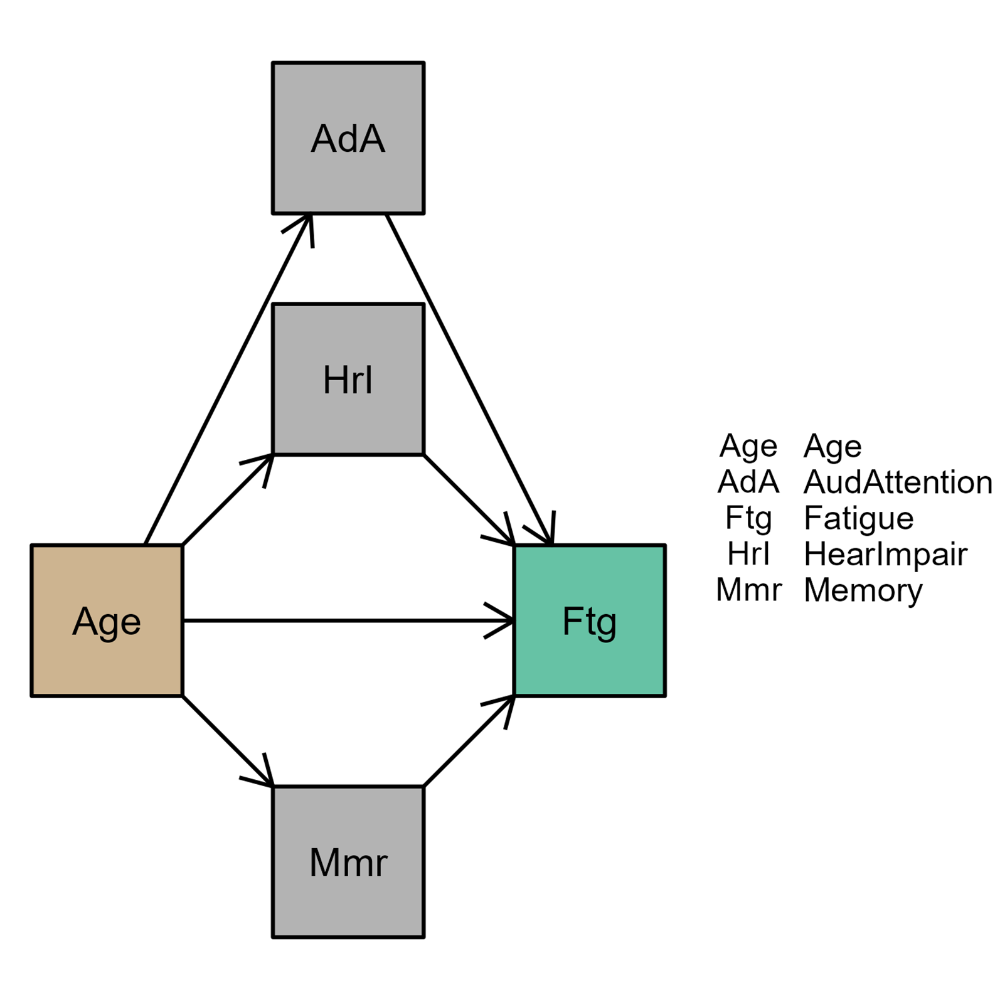
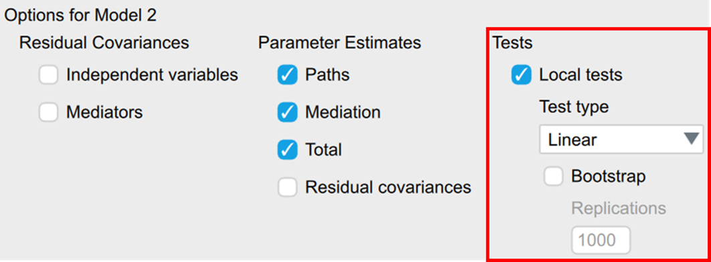

<span class="section-badge advanced">Advanced Topics</span>

Mediation and moderation both involve a third variable in the relationship between a predictor (X) and an outcome (Y) — but they ask fundamentally different questions.

| | Question | Terminology |
|---|---|---|
| **Mediation** | *How* does X affect Y? (through what mechanism?) | Indirect effect, mediator (M) |
| **Moderation** | *For whom* or *when* does X affect Y? | Interaction effect, moderator (W) |

In JASP, both are estimated using the **PROCESS module**, developed by Andrew Hayes.

---

## Mediation

### What is it?

Mediation tests whether the effect of X on Y is *transmitted through* a third variable M (the mediator).

```
X → M → Y      (indirect effect)
X → Y          (direct effect, controlling for M)
```

The **total effect** of X on Y is decomposed into:

- **Direct effect**: the effect of X on Y after accounting for M
- **Indirect effect** (*a × b*): the effect of X on Y that goes through M (= path *a* × path *b*)

::: {.callout-tip collapse=true}
## Decomposing the total effect
The trick of mediation: the original X → Y relationship gets split into two pathways. The *direct* effect (X → Y, controlling for M) and the *indirect* effect (X → M → Y). A relationship that's *completely mediated* by M tells a very different psychological story than one with no mediation at all.
:::

### Assumptions

::: {.assumption-list}
- The causal ordering X → M → Y must be theoretically justified — mediation analysis does not prove causality
- All variables are measured without error (impossible in practice, but a key limitation to acknowledge)
- There is no unmeasured confounding of the X → M, M → Y, or X → Y relationships
- **No interaction between X and M** — if you suspect one, use moderated mediation (Hayes Model 8 or 14)
:::

### Inference: bootstrapping

The indirect effect (*a × b*) is non-normally distributed. JASP uses **bootstrapped confidence intervals** (typically 5000–10000 samples). An indirect effect is considered significant if the 95% CI does not contain zero.

### How to do it in JASP

Install the PROCESS module: click the blue **+** icon in the top-right of the JASP window to open the module list, then enable **PROCESS**.

::: {.callout-note icon=false}
## JASP Video Library — Mediation
Recordings at [jasp-stats.github.io/jasp-video-library/All_PROCESS.html#mediation](https://jasp-stats.github.io/jasp-video-library/All_PROCESS.html#mediation):

- [▶ Load Module](https://jasp-stats.github.io/jasp-video-library/All_PROCESS.html#load-module) — installing and opening the PROCESS module
- [▶ Specify Model](https://jasp-stats.github.io/jasp-video-library/All_PROCESS.html#specify-model) — assigning X, M, and Y; bootstrapped indirect effects
- [▶ Hayes Model](https://jasp-stats.github.io/jasp-video-library/All_PROCESS.html#specify-hayes-model) — using pre-defined Hayes templates (Model 4 for simple mediation)
:::

### Interpreting mediation output

| Path | What to look for |
|---|---|
| **Path *a*** | X → M: is the predictor associated with the mediator? |
| **Path *b*** | M → Y: does the mediator predict the outcome, controlling for X? |
| **Direct effect** (c') | X → Y controlling for M: has the effect changed from the total effect? |
| **Indirect effect** (*a × b*) | Is the 95% bootstrapped CI excluding zero? |

**Full mediation**: the direct effect becomes non-significant once M is included — X only affects Y through M.
**Partial mediation**: both direct and indirect effects remain significant.

::: {.callout-tip}
## APA reporting
Report the indirect effect with its bootstrapped CI: *indirect effect* = [value], 95% CI [lower, upper]. For the direct and total effects, report *b*, SE, *t*, *p*.
:::

---

## Moderation

### What is it?

Moderation tests whether the effect of X on Y **differs across levels of a third variable** W (the moderator). Statistically, this is an **interaction effect**: you add the product term X × W to the regression model.

If the X × W interaction is significant, the slope of X on Y is different at different values of W.

::: {.callout-tip collapse=true}
## Moderation = interaction = "steering"
A useful mnemonic: *to moderate* means to *steer* — to control how something unfolds. Statistically, moderation is just an interaction effect: one predictor steers how another predictor affects the outcome. Which of the two predictors gets called "the moderator" is somewhat arbitrary — it's about which framing matches your theoretical question.
:::

### Assumptions

::: {.assumption-list}
- The same as multiple regression — see the [Regression](../core/regression.qmd) page
- **Centering**: for continuous moderators, it is good practice to mean-centre X and W before computing the product term. This reduces multicollinearity and makes the lower-order coefficients interpretable. JASP does this automatically
:::

### Simple slopes and interaction plots

After a significant moderation, inspect **simple slopes**: the slope of X on Y at specific values of W (typically *M* − 1 *SD*, *M*, *M* + 1 *SD* for a continuous moderator). JASP provides simple slope plots and significance tests.

### How to do it in JASP

::: {.callout-note icon=false}
## JASP Video Library — Moderation
Recordings at [jasp-stats.github.io/jasp-video-library/All_PROCESS.html#moderation](https://jasp-stats.github.io/jasp-video-library/All_PROCESS.html#moderation):

- [▶ Specify Model](https://jasp-stats.github.io/jasp-video-library/All_PROCESS.html#specify-model-1) — entering X, W, and the X×W product term
- [▶ Hayes Model 1](https://jasp-stats.github.io/jasp-video-library/All_PROCESS.html#specify-hayes-model-1) — simple moderation using a Hayes template
- [▶ Flexplot](https://jasp-stats.github.io/jasp-video-library/All_PROCESS.html#flexplot) — visualising the interaction
- [▶ Simple Slopes Plot](https://jasp-stats.github.io/jasp-video-library/All_PROCESS.html#statistical-plot) — effect of X at low/medium/high levels of W
:::

---

## Moderated mediation

When moderation and mediation are combined — the indirect effect of X on Y through M depends on the level of W — this is **moderated mediation** (or **conditional indirect effect**). Hayes' Model 8 and Model 14 are the most common configurations.

The indirect effect is estimated separately at different values of W. A **Johnson-Neyman interval** identifies the exact range of W values for which the indirect effect is significant.

---

## The PROCESS module up close

Beyond simple mediation and moderation, JASP's **Process** module supports general multi-step causal models with several mediators and moderators specified as a DAG. The walkthrough below follows Lüken, Vroegh, Rohrer, van Doorn & Wagenmakers (2024), which uses data from McGarrigle et al. (2021) on listening-related fatigue across the adult lifespan (*N* = 281). The research question is: does the relationship between **age** and **listening fatigue** run through auditory attention, perceived hearing impairment, perceived memory, and mood disturbances?

::: {.callout-tip}
## PROCESS in JASP is *not* the same code as the SPSS PROCESS macro
The JASP module fits PROCESS-style models via **structural equation modelling** (lavaan under the hood). That means you specify which variables are mediators / moderators *explicitly* in a DAG, rather than picking a Hayes template number. This forces you to think about which causal structure you're assuming — and lets you test goodness-of-fit, which the SPSS PROCESS macro does not (Lüken et al., 2024).
:::

### Step 1 — Assign variables

After installing the *Process (beta)* module, open **Process → Classic Process Model**. Drag the outcome into *Dependent Variable* and every predictor / mediator / moderator into *Continuous Predictors* or *Categorical Predictors*.

{fig-align="center" width=620}

### Step 2 — Specify the causal paths

In the *Models* section, click the green **+** for each path you want in the model. For every path, pick variables in the *From* and *To* dropdowns and a *Process Type* (*Direct*, *Mediator*, or *Moderation*). The example below codes a multi-mediator model: age has a direct effect on fatigue, plus indirect effects through auditory attention, hearing impairment, and memory.

{fig-align="center" width=480}

### Step 3 — Tick the right options

Under *Options*, request **Bootstrap** confidence intervals (the default for indirect effects). To check whether the implied causal model is consistent with the data, tick **Local tests** under *Tests* — these test the conditional-independence implications of your DAG, and significant ones flag model misspecification:

{fig-align="center" width=560}

### Step 4 — Read the mediation-effects table

The headline output is the *Mediation effects* table, which breaks down the total effect of X on Y into the direct effect plus each specific indirect path, with bootstrapped CIs:

![Decomposition of the age → fatigue relationship. The direct effect is significant and negative (older adults report less fatigue, holding the mediators constant). Among the indirect paths, only **age → HearImpair → Fatigue** is significant (95% CI [0.031, 0.115]) — older adults perceive more hearing impairment, which in turn predicts more fatigue.](../assets/images/blog/process/figure-7.png){fig-align="center" width=720}

### Comparing competing models

The module supports adding multiple models side-by-side (each with its own causal graph and option panel) and compares them via AIC, BIC, and AIC/BIC weights. In the worked example, the authors add a *Model 2* that includes age × MoodDisturb as a moderator on the path to fatigue. AIC/BIC favour the larger model, but the interaction term itself is not significant — reproducing the original McGarrigle et al. finding that mood does not moderate the age-fatigue relationship.

### Caveats from the tutorial

Lüken et al. (2024) close with three warnings worth repeating:

1. **The module assumes your DAG is correct.** It can test the *statistical* implications of a specified structure (conditional independencies, fit), but no test can distinguish your structure from one with reversed arrows. Causal-direction claims still need theory or experimental manipulation.
2. **Unobserved confounders bias indirect effects** even in experimental designs that manipulate X. PROCESS results are conditional on the no-unobserved-confounders assumption — say so explicitly when reporting.
3. **Don't chase fit by tweaking the model after seeing local-test results.** Modifying the model post-hoc on the basis of failed local tests is the SEM equivalent of HARKing. If the fit is poor, report it, hypothesise an alternative structure, and test that on a different sample.

→ **Full tutorial**: [Lüken, M., Vroegh, T., Rohrer, J. M., van Doorn, J., & Wagenmakers, E.-J. (2024). Causal inference in JASP: The Process module](https://jasp-stats.org/2024/01/29/causal-inference-in-jasp-the-process-module/) — JASP blog. Walks through the listening-fatigue worked example end-to-end, including the Model 1 vs Model 2 comparison.

---

## Further reading

- **DSUJ Chapter 10** — *Moderation and mediation* — comprehensive treatment with PROCESS walkthroughs
- [Hayes, A. F. (2022). *Introduction to mediation, moderation, and conditional process analysis*](https://www.guilford.com/books/Introduction-to-Mediation-Moderation-and-Conditional-Process-Analysis/Andrew-Hayes/9781462549030) — the definitive text

---

## Further viewing — SSR lecture recordings

The 2026 SSR lectures cover moderation and mediation across two recordings (captions are available in the SharePoint player):

- [▶ SSR Lecture 26 — Moderation](https://amsuni-my.sharepoint.com/:v:/g/personal/j_b_vandoorn_uva_nl/EfNB5ydwSIlHjivPr0yhlzkBc5X_fmr7HkcxVKaCNvrF6A?nav=eyJyZWZlcnJhbEluZm8iOnsicmVmZXJyYWxBcHAiOiJPbmVEcml2ZUZvckJ1c2luZXNzIiwicmVmZXJyYWxBcHBQbGF0Zm9ybSI6IldlYiIsInJlZmVycmFsTW9kZSI6InZpZXciLCJyZWZlcnJhbFZpZXciOiJNeUZpbGVzTGlua0NvcHkifX0&e=gYOVYt)
- [▶ SSR Lecture 27 — Mediation](https://amsuni-my.sharepoint.com/:v:/g/personal/j_b_vandoorn_uva_nl/EUHEfkBgB5xKuP2bJkd2XbIBi88dHPwHTAY1aHHOLipkFw?nav=eyJyZWZlcnJhbEluZm8iOnsicmVmZXJyYWxBcHAiOiJPbmVEcml2ZUZvckJ1c2luZXNzIiwicmVmZXJyYWxBcHBQbGF0Zm9ybSI6IldlYiIsInJlZmVycmFsTW9kZSI6InZpZXciLCJyZWZlcnJhbFZpZXciOiJNeUZpbGVzTGlua0NvcHkifX0&e=anM8Bi)

---

## Try it yourself

Each exercise below ends with a collapsible solution. Try the analysis first, then expand to compare.

### Exercise 1 (mediation) — Does mate value mediate the age → gossiping relationship?

Older adults gossip more than younger adults — but is this transmitted through changes in perceived **mate value**? Using [`leni_10.jasp`](https://discoverjasp.com/repository/dsj1_leni/leni_10.jasp), fit a Hayes Model 4 mediation with age as X, mate value as M, and gossiping tendency as Y. Report the indirect effect with its bootstrapped 95% CI.

::: {.callout-note collapse=true icon=false}
## ▸ Worked solution
- **Walkthrough**: [Labcoat Leni — I heard that Jane has a boil and kissed a tramp](https://discoverjasp.com/pages/labcoat_leni#i-heard-that-jane-has-a-boil-and-kissed-a-tramp)
- **Annotated JASP output**: [leni_10.html](https://discoverjasp.com/repository/dsj1_leni/leni_10.html)
:::

### Exercise 2 (moderation) — Does the attractiveness → spousal-support relationship differ for husbands vs wives?

McNulty et al. (2008) tested whether attractiveness predicts how much support newlyweds give their partner — and whether this relationship is *moderated* by being the husband vs the wife. Using [`mcnulty_2008.jasp`](https://discoverjasp.com/repository/dsj1_data/data/mcnulty_2008.jasp), fit a Hayes Model 1 moderation with `attractiveness` as the continuous predictor, `spouse` as the categorical moderator, and `support` as the outcome. Inspect the simple slopes.

::: {.callout-note collapse=true icon=false}
## ▸ Worked solution
- **Walkthrough**: [Smart Alex Task 10.1](https://discoverjasp.com/pages/smart_alex#task-10.1)
- **Annotated JASP output**: [alex_10_01-03.html](https://discoverjasp.com/repository/dsj1_alex/alex_10_01-03.html)
:::

### Exercise 3 (mediation) — Does product-perceived-coolness mediate the advert → desirability path?

A company owner measured how cool people thought the **advertising** was, how cool they thought the **product** was, and how **desirable** they found the product. Using [`tablets.jasp`](https://discoverjasp.com/repository/dsj1_data/data/tablets.jasp), test whether the relationship between advertising coolness and product desirability is mediated by product coolness.

::: {.callout-note collapse=true icon=false}
## ▸ Worked solution
- **Walkthrough**: [Smart Alex Task 10.5](https://discoverjasp.com/pages/smart_alex#task-10.5)
- **Annotated JASP output**: [alex_10_05.html](https://discoverjasp.com/repository/dsj1_alex/alex_10_05.html)
:::
