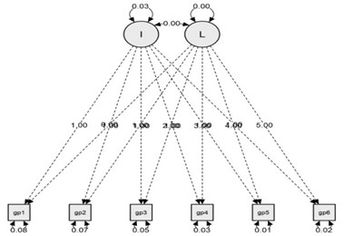
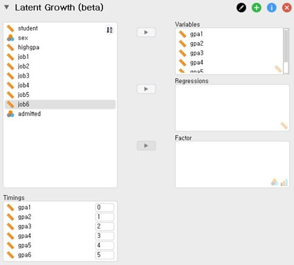
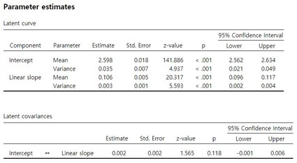
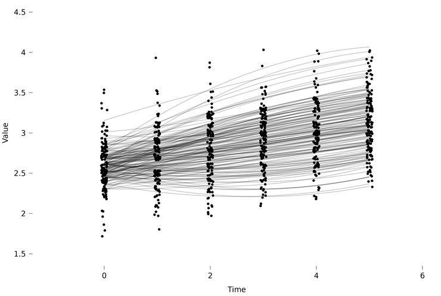

Advanced Topics

Path modeling extends multiple regression to **systems of simultaneous equations** with multiple outcomes. Instead of a single dependent variable, you specify a network of directed relationships where one variable can be both predictor *and* outcome (in different equations), and indirect effects propagate through the system. When the variables in the network are *observed* (no latent constructs), this is **path analysis**. When latent variables are added, the full system is a **structural equation model (SEM)**, of which path analysis is the historically older, more limited case (Kline, 2023, Ch 1).

Path modeling and CFA are the two basic building blocks of SEM:

- **CFA** (covered on the [Factor Analysis](factor-analysis.qmd) page) tells you that a set of items reflects a latent construct — the *measurement* model.
- **Path modeling** tells you how variables (latent or observed) are *causally* related to each other — the *structural* model.
- Combined, they yield the full SEM (Kline, 2023, Ch 15 calls this a **structural regression model**).

This page focuses on **observed-variable path analysis**: the structural model in isolation. The CFA piece is on the other page.

---

## What does a path model look like?

The conventional notation (Kline, 2023, Ch 7):

| Symbol | Meaning |
|---|---|
| Rectangle | Observed (manifest) variable |
| Oval / circle | Latent variable (not in pure path analysis, but you'll see them once you move to full SEM) |
| Single-headed arrow → | Hypothesised directed (causal) effect |
| Double-headed arrow ↔ | Covariance / unanalysed association — used between exogenous variables and between disturbance terms |
| Small arrow into a variable from "nowhere" | The **disturbance** — unexplained variance, analogous to the regression residual |

A path model is essentially a directed acyclic graph (DAG) over your variables, with the strengths of the arrows being the parameters you estimate.

---

## Recursive, nonrecursive, and partially recursive

Kline (Ch 7) classifies path models by whether feedback loops are present:

| Type | Definition | Example |
|---|---|---|
| **Recursive** | All causal arrows point "forward"; no feedback loops, and disturbances of endogenous variables are uncorrelated | A linear chain X → M → Y |
| **Nonrecursive** | Contains a feedback loop (X → Y → X) OR correlated disturbances between variables that affect each other | Simultaneous-equation models in economics; reciprocal influence between two related constructs |
| **Partially recursive** | Mostly recursive, but with correlated disturbances among some pairs of endogenous variables | A common pattern in psychological mediation models |

**Why it matters**: recursive models are easier to identify, estimate, and interpret. Nonrecursive models require special identification conditions (the *order* and *rank* conditions; Kline Ch 19) and instrumental variables. Recursive is the default — only step into nonrecursive territory when theory genuinely requires it.

---

## Direct, indirect, and total effects

In a path with X → M → Y plus X → Y:

| Effect | Definition | How to compute |
|---|---|---|
| **Direct effect of X on Y** | The arrow from X to Y, holding everything else constant | The regression coefficient on the X → Y path |
| **Indirect effect of X on Y through M** | The product of X → M and M → Y | `a × b` |
| **Total effect of X on Y** | Direct + sum of all indirect paths | `c' + a × b` |

The **specific indirect effect** for each pathway should be reported separately when there are multiple mediators — not just the total indirect effect (Kline, 2023, Ch 20). Standard errors and CIs for indirect effects are non-normal; use **bootstrapping** (≥ 5000 resamples) to obtain bias-corrected percentile CIs.

The [Mediation & Moderation](mediation-moderation.qmd) page covers the simple X → M → Y case using the PROCESS module. Path modeling generalises this to arbitrarily complex DAGs with multiple mediators, multiple outcomes, and (optionally) latent variables.

---

## Identification

A model is **identified** if every parameter has a unique solution given the observed covariance matrix. The basic requirement is:

$$\text{model df} = \text{number of unique elements in the covariance matrix} - \text{number of free parameters} \geq 0$$

With *p* observed variables, the covariance matrix has *p*(*p* + 1)/2 unique elements (variances + covariances). Subtract the free parameters you want to estimate (path coefficients, variances, covariances). If df < 0, the model is **under-identified** and cannot be estimated. df = 0 is **just-identified** (saturated) — the model fits perfectly by construction and cannot be falsified. df > 0 is **over-identified** — the model imposes restrictions that the data may or may not support; this is where fit testing becomes informative.

::: {.callout-tip collapse=true}
## A worked example of the counting rule
With 4 observed variables, the covariance matrix has 4 × 5 / 2 = 10 unique elements. Suppose you specify a model with 7 free parameters (3 path coefficients, 4 variances). Then df = 10 − 7 = 3. The model is over-identified with 3 degrees of freedom — it imposes 3 restrictions on the data, and a χ² test of model fit has df = 3.
:::

For nonrecursive models with feedback loops, the **order and rank conditions** must additionally be satisfied (Kline, Ch 19). The order condition is necessary; the rank condition is sufficient.

---

## Estimation

Most path models are estimated by **Maximum Likelihood (ML)** (Kline, Ch 9). ML assumes multivariate normality of the endogenous variables. Variants:

| Method | When to use |
|---|---|
| **Default ML** | Continuous endogenous variables, multivariate normality plausible |
| **Robust ML (MLM / MLR)** | Continuous endogenous variables, but non-normal distribution (heavy tails, skew) — gives Satorra-Bentler scaled χ² and robust SEs |
| **FIML** | Missing data on the endogenous variables, MAR mechanism — uses all available cases; the gold-standard alternative to listwise deletion or multiple imputation in SEM |
| **WLSMV / DWLS** | Ordinal or categorical endogenous variables (e.g. Likert items treated as ordered) |

In `lavaan`: `sem(model, data, estimator = "ML" / "MLR" / "WLSMV", missing = "fiml")`.

---

## Global model fit

The starting point is the **model χ²** test (Kline, Ch 10): under the null that the model is correctly specified, model χ² follows a chi-square distribution. A **non**-significant χ² means the model fits — but for large samples, χ² is so powerful that essentially every interesting model fails it. In practice, χ² is reported alongside *approximate fit indices* (AFIs):

| Index | What it captures | Conventional cutoff for "acceptable fit" |
|---|---|---|
| **RMSEA** | Penalised badness-of-fit per df | ≤ .06 (good), .06–.08 (acceptable), > .10 (poor) |
| **CFI** | Improvement over the null model | ≥ .95 (good), ≥ .90 (acceptable) |
| **SRMR** | Standardised residual covariances | ≤ .08 (good) |
| **TLI** (NNFI) | Like CFI but penalised for complexity | ≥ .95 |

::: {.callout-warning}
## Cutoffs are conventions, not laws
Hu & Bentler's (1999) cutoffs (CFI ≥ .95, RMSEA ≤ .06, SRMR ≤ .08) are widely used but were derived under specific simulation conditions. Kline (Ch 10) cautions against rigid thresholds and recommends evaluating model fit in light of model complexity, sample size, and the substantive plausibility of the structure. Report multiple AFIs and don't treat any single cutoff as decisive.
:::

---

## Local fit and respecification

Global fit indices tell you whether the model fits *overall*, but not *where* the misfit lives. For local diagnostics (Kline Ch 11):

- **Standardised residuals** of the covariance matrix — values |z| > 2.58 (|z| > 1.96 in some conventions) flag specific cell-by-cell discrepancies.
- **Modification indices (MIs)** — for each fixed parameter, the expected reduction in χ² if it were freed. Large MIs suggest where the model could be improved.

::: {.callout-warning}
## Respecification has costs
Adding a parameter because the MI suggests it is **empirical respecification** — it capitalises on sample-specific noise and reduces the probability that the modified model will replicate. Kline (Ch 11, "Empirical versus theoretical respecification") is firm: every freed parameter should have a **theoretical justification**, not merely an MI. Always explicitly label respecifications as a priori or post hoc, and validate post-hoc changes in a held-out sample where possible.
:::

---

## Comparing nested models

Two models are **nested** when one is a constrained version of the other (i.e. one fixes parameters that the other estimates). Comparison is via the **χ² difference test**:

$$\Delta\chi^2 = \chi^2_{\text{constrained}} - \chi^2_{\text{free}} \quad \text{with} \quad \Delta\text{df} = \text{df}_{\text{constrained}} - \text{df}_{\text{free}}$$

A significant Δχ² means the constraints worsened fit, and the free model is preferred. As with global χ², this test is sample-size sensitive — report ΔCFI alongside Δχ² for large samples (analogously to the practical thresholds discussed on the [Measurement Invariance](measurement-invariance.qmd) page).

For **non-nested** model comparison, use information criteria (AIC, BIC) rather than χ² difference.

---

## Multi-group path models

Path models can be fit simultaneously to two or more groups. This lets you ask whether the *structural* paths (and not just the measurement model) are equivalent across groups. Kline (Ch 12) walks through this for the path-model case; the underlying machinery is the same as for multi-group CFA — fit a configural model with all parameters free across groups, then impose increasingly restrictive equality constraints and test via Δχ² and ΔCFI.

In `lavaan`: `sem(model, data, group = "G", group.equal = c("regressions", "intercepts"))`.

---

## Latent growth curve modelling (a longitudinal special case)

A **latent growth curve model (LGCM)** is a particular path model for **repeated measures on the same outcome over time**. Instead of treating the six waves of an outcome as six correlated indicators of a single construct, an LGCM decomposes them into two (or more) latent factors that describe *each respondent's individual trajectory*:

- an **intercept** factor (I) — each person's baseline level
- a **linear slope** factor (S or L) — each person's rate of change per unit of time

The trick is that the slope's factor loadings are **fixed to the time codes** (e.g. 0, 1, 2, 3, 4, 5 for six equally-spaced waves), while the intercept's loadings are all fixed to 1. Everything else is estimated. The result is a path model whose parameters answer two distinct questions: *what is the average trajectory?* (means of I and S) and *how much do individuals differ around it?* (variances of I and S, and their covariance).

{fig-align="center" width=420}

### Specifying it in JASP

In JASP's **SEM → Latent Growth** dialog, drag the six waves of the outcome into *Variables*. The *Timings* panel beneath shows the implied time codes (0, 1, 2, …) — adjust them if your measurement occasions are unequally spaced.

{fig-align="center" width=420}

### Reading the output

The headline table reports the **means** and **variances** of the latent intercept and slope, plus their **covariance**:

{fig-align="center" width=520}

Interpretation of each row:

| Parameter | Substantive meaning |
|---|---|
| **Intercept – Mean** | The average outcome at the reference timepoint (time = 0). |
| **Intercept – Variance** | How much people differ in their starting level. A significant variance means there *is* meaningful between-person variation to explain with covariates. |
| **Slope – Mean** | The average rate of change per unit of time. A significant non-zero mean is the headline result for "is there growth on average?". |
| **Slope – Variance** | Whether people differ in their rate of change — the prerequisite for asking what predicts those individual differences. |
| **Intercept ↔ Slope covariance** | Whether starting higher is associated with steeper (positive cov.) or shallower (negative cov.) growth. |

### Common extensions

- **Predictors of growth** — drag time-invariant covariates (e.g. sex, baseline scores) into *Regressions* (continuous) or *Factor* (categorical). Their coefficients quantify how those covariates predict the intercept and slope factors *separately*. *Note: the current JASP release does not handle time-varying covariates — switch to `lavaan` directly if those matter for your model.*
- **Quadratic growth** — tick the *Quadratic* option in *Model Options* to add a second slope factor with loadings fixed to 0, 1, 4, 9, 16, 25. This lets trajectories bend, which is often the more realistic picture once you look at the individual lines:

{fig-align="center" width=520}

- **Multi-group LGCM** — fit the same growth model separately in two or more groups, then test whether the average intercept and slope differ across groups using the multi-group machinery described above.

### Caveats

The blog tutorial (van Kesteren, Heo & Koch, 2022) flags two practical points worth repeating:

1. **Fit indices may disagree.** In the GPA example, CFI and TLI were comfortably > 0.95 but RMSEA was 0.093 (above the conventional 0.06 cutoff) and the model χ² was significant. With longitudinal data this kind of disagreement is common — lean on the *substantive* plausibility of the trajectories alongside the numerical fit.
2. **Visualise the curves.** Numerical estimates alone hide what individual trajectories look like. Always request the curve plot — it is usually more informative for interpretation than the parameter table.

→ **Full tutorial**: [van Kesteren, E.-J., Heo, I., & Koch, M. (2022). Latent growth curve modeling (LGCM) in JASP](https://jasp-stats.org/2022/02/22/latent-growth-curve-modeling-lgcm-in-jasp/) — JASP blog. The walkthrough uses the GPA dataset from Hox, Moerbeek & van de Schoot (2017) and goes deeper into the quadratic and covariate extensions.

---

## How to do it in JASP

<!-- JASP TODO: verify exact menu path, option labels, and whether JASP exposes lavaan's full group.equal vocabulary. -->

JASP's **SEM** module wraps `lavaan`. The typical workflow:

1. **Specify the model** using lavaan syntax — e.g. `Y ~ X + M; M ~ X` (each line is a regression equation).
2. **Choose the estimator** — ML by default; MLR for non-normal data; FIML via the missing-data option for incomplete cases.
3. **Run the model** and inspect:
   - The **fit table** (χ², df, *p*, CFI, RMSEA, SRMR).
   - The **regression-coefficients table** (path estimates, standard errors, z-tests).
   - **Standardised** estimates for cross-path comparison.
4. **Request indirect effects** if mediators are present — JASP supports bootstrapped CIs for indirect effects via lavaan's `:=` syntax.
5. **Request modification indices** for local diagnostics, with the caveats above.

For multi-group analysis, set the grouping variable in the SEM dialog and add group-equality constraints incrementally. For full SEM (path + CFA combined), define your latent variables with `=~` and your structural paths with `~`.

---

## Reporting

::: {.callout-tip}
## Reporting a path/SEM analysis (per APA JARS-Quant)
The 2018 APA Journal Article Reporting Standards for quantitative research (Appelbaum et al., 2018; reproduced in Kline, 2023, Table 3.1) lay out the expected sections. At minimum:

1. **Justify directionality assumptions** in the introduction — why X → Y rather than the reverse.
2. **Full model specification**: describe each measured variable, every free / fixed / constrained parameter, and verify identification (count parameters and report df).
3. **Estimation details**: software + version, estimator (ML / MLR / WLSMV), missing data treatment (FIML / MI / listwise).
4. **Global fit** with at least two AFIs (Kline insists on RMSEA + CFI + SRMR as a triplet), interpreted against conventional thresholds.
5. **Local fit** — describe residual or modification-index inspection, and any respecifications (a priori vs post hoc).
6. **All free parameter estimates** with standard errors — *both* unstandardised and standardised.
7. **Indirect effects** with bootstrapped standard errors and CIs, and the analysis strategy.
8. **Equivalent / near-equivalent models** — justify why the retained model is preferred over plausible alternatives that fit equally well.
:::

---

## Further reading

- **Kline, R. B. (2023).** *Principles and practice of structural equation modeling* (5th ed.). Guilford Press. — The standard text. Chapter 6–7 (causal models, path diagrams), 9 (estimation), 10 (fit), 11 (comparison), 12 (multi-group), 15 (full SEM), 20 (mediation).
- **Bollen, K. A. (1989).** *Structural equations with latent variables.* Wiley. — The classical mathematical reference; older but still widely cited.
- **Rosseel, Y. (2012).** lavaan: An R package for structural equation modeling. *Journal of Statistical Software*, 48(2), 1–36. — The lavaan paper. Online docs at [lavaan.ugent.be](https://lavaan.ugent.be).
- **Appelbaum, M., Cooper, H., Kline, R. B., Mayo-Wilson, E., Nezu, A. M., & Rao, S. M. (2018).** Journal article reporting standards for quantitative research in psychology: The APA Publications and Communications Board Task Force report. *American Psychologist*, 73(1), 3–25.
- For mediation specifically: **Hayes, A. F. (2022).** *Introduction to mediation, moderation, and conditional process analysis* (3rd ed.). Guilford Press.

---

## Software notes

| Software | What it does | Notes |
|---|---|---|
| **JASP (SEM module)** | Path analysis + full SEM via lavaan | <!-- JASP TODO: confirm UI labels for indirect-effect estimation and group-equality constraints --> |
| R: `lavaan` | The de facto open-source standard | Free; flexible syntax; integrates with `semTools` for invariance testing, `lavaanPlot` for diagrams |
| R: `piecewiseSEM` | Local-estimation SEM (Lefcheck, 2020) | Useful for non-normal outcomes and small samples where global ML is fragile |
| Mplus | Long-time field standard | Commercial; comprehensive coverage of advanced models (LCA, multilevel SEM) |
| AMOS (SPSS) | GUI-driven SEM | Commercial; popular in clinical/health psychology |
