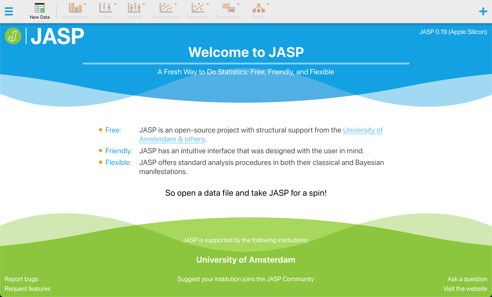
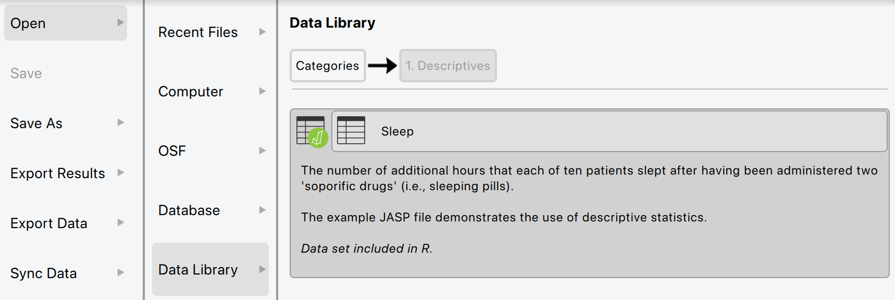
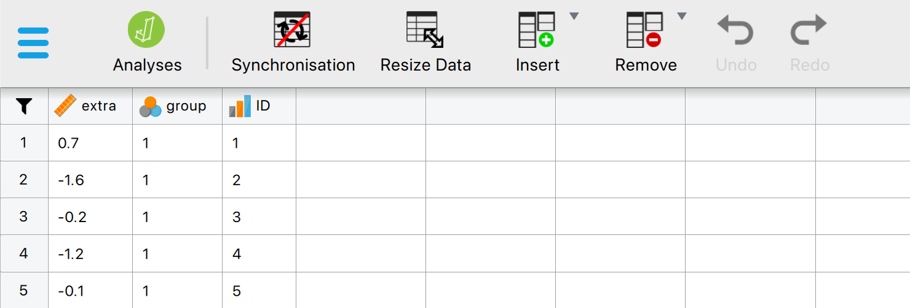
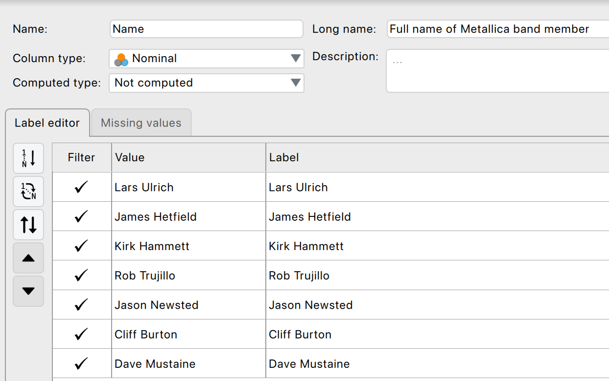

JASP is free, open-source statistical software developed at the University of Amsterdam. It is designed to make statistical analyses intuitive and interactive — output updates in real time as you change settings.

{fig-align="center" width=560}

## Download and install JASP

Go to [jasp-stats.org/download](https://jasp-stats.org/download/) and download the installer for your operating system (Windows, macOS, or Linux). Installation is straightforward; no licence is required.

::: {.callout-tip}
## Which version?
Always download the latest stable release. If you are working on a university computer that already has JASP installed, make sure it is reasonably recent — some modules used on this site require a recent version.
:::

---

## Loading data into JASP

JASP can open several file formats: `.jasp` (JASP's own format), `.csv`, `.sav` (SPSS), `.xlsx`, `.ods`, and more.

- **A `.jasp` file** contains both the dataset and any pre-configured analyses, so opening one drops you straight into the analysis. Double-click it or use *File → Open*.
- **A `.csv` / `.sav` / `.xlsx` file** opens as a plain spreadsheet — after opening, check that every variable has the correct measurement level (the small icon next to the column header).
- **A dataset from the built-in Data Library** — JASP ships with a curated set of practice datasets organised by topic. *File → Open → Data Library* lets you browse and load any of them in one click; each comes with a short description.

{fig-align="center" width=620}

→ [▶ Loading Data](https://jasp-stats.github.io/jasp-video-library/Getting-Started.html#loading-data) (JASP Video Library, ~1 min) walks through opening a file and inspecting it.

---

## The JASP interface

When you open a dataset, the JASP window is divided into three panels:

| Panel | What it shows |
|---|---|
| **Left** — Data | The spreadsheet with your variables and cases |
| **Middle** — Analysis menu | The list of available statistical tests |
| **Right** — Output | Results that update in real time as you configure the analysis |

{fig-align="center" width=640}

### Variable types

JASP recognises three measurement levels (DSUJ §4.6.2). The icon next to each column header tells you which is currently assigned; click it to change.

- {height=18 style="vertical-align: middle"} **Nominal** — unordered categories (e.g. treatment group, gender identity).
- {height=18 style="vertical-align: middle"} **Ordinal** — ordered categories with no guaranteed equal spacing (e.g. Likert items if you want to be conservative, education level, satisfaction rating).
- {height=18 style="vertical-align: middle"} **Scale** (continuous / interval / ratio) — numeric measurements with meaningful spacing (e.g. reaction time, exam score, IQ).

The measurement level matters because JASP uses it to determine which analyses become available, how to dummy-code in regression, and how to render plots. Each variable also carries a **value** (what JASP computes on) and a **label** (what the output shows) — nominal and ordinal variables can have non-numeric labels, but scale variables need numeric values.

---

## Editing and preparing your data

A surprising amount of time in any analysis goes into data preparation. JASP's data editor handles most of what you'd otherwise use SPSS *Transform* or R `dplyr` for, including:

### Categories: rename, reorder, reverse-code

| Task | JASP Video Library |
|---|---|
| Rename a category's label (e.g. "1" → "control") | [▶ Renaming Categories](https://jasp-stats.github.io/jasp-video-library/Getting-Started.html#renaming-categories) |
| Reorder ordinal categories | [▶ Reordering Categories](https://jasp-stats.github.io/jasp-video-library/Getting-Started.html#reordering-categories) |
| Add a missing category level | [▶ Add Levels](https://jasp-stats.github.io/jasp-video-library/Getting-Started.html#add-levels) |
| Reverse-code a Likert item (single) | [▶ Reverse Code Single](https://jasp-stats.github.io/jasp-video-library/Getting-Started.html#reverse-code-single) |
| Reverse-code several items at once | [▶ Reverse Code Multiple](https://jasp-stats.github.io/jasp-video-library/Getting-Started.html#reverse-code-multiple) |

### Variable transformations

| Task | JASP Video Library |
|---|---|
| Compute a new column from an existing one | [▶ Compute New Column](https://jasp-stats.github.io/jasp-video-library/Getting-Started.html#compute-new-column) |
| Conditional recode (if/else logic) | [▶ Use If Else](https://jasp-stats.github.io/jasp-video-library/Getting-Started.html#use-if-else) |
| Centre / standardise a continuous variable (z-scores) | [▶ Center Variable](https://jasp-stats.github.io/jasp-video-library/Getting-Started.html#center-variable) |
| Convert a continuous variable to its ranks | [▶ Convert to Ranks](https://jasp-stats.github.io/jasp-video-library/Getting-Started.html#convert-to-ranks) |

### Sum scores and row-level summaries

Aggregating multiple items into a single scale score (e.g. summing the seven items of a depression questionnaire) is a one-step drag-and-drop in JASP, with R-code alternatives for reproducibility:

| Task | JASP Video Library |
|---|---|
| Row sum (sum scores) — drag and drop | [▶ Drag and Drop RowSum](https://jasp-stats.github.io/jasp-video-library/Getting-Started.html#drag-and-drop-rowsum) |
| Row mean (averaged scale score) — drag and drop | [▶ Drag and Drop RowMean](https://jasp-stats.github.io/jasp-video-library/Getting-Started.html#drag-and-drop-rowmean) |
| Same, scripted in R | [▶ R RowSum](https://jasp-stats.github.io/jasp-video-library/Getting-Started.html#r-rowsum) · [▶ R RowMean](https://jasp-stats.github.io/jasp-video-library/Getting-Started.html#r-rowmean) |

### Missing values

JASP automatically treats the strings `NA`, `NaN`, `nan`, and `.` as missing (DSUJ §4.6.3). Empty cells also count as missing. If your dataset uses a sentinel value like `999` or `-99` for missing, declare it: open the variable's settings, go to the **Missing values** tab, tick **Custom missing values**, and enter the sentinel. JASP will then exclude those rows from analyses that involve the variable, instead of treating them as real data.

{fig-align="center" width=620}

::: {.callout-warning}
## Don't leave coded-missing values undeclared
Forgetting to declare `999` as missing is one of the most common silent errors in psychology data. The analysis runs, the numbers look fine, but every mean is inflated by the un-recoded missing values. Always inspect the *Valid* column in *Descriptives* against the dataset's row count — they should match if there's no missingness.
:::

---

## Filtering data

Use a filter when you want to run analyses on a subset of cases — e.g. only female participants, only the within-budget condition, only respondents above a threshold (DSUJ §4.6.4). JASP has three ways:

1. **Tick boxes on a categorical variable** — open Variable settings, switch to the Filter column, untick categories you want to exclude.
2. **Drag-and-drop filter builder** — click the funnel (▼) icon at the top-left of the data window to open a graphical filter. Drag a variable across, pick an operator (`>`, `<`, `==`, `!=`, …), enter a value, and apply.
3. **R code** — for more complex conditions (e.g. interactions of multiple variables), the same dialog has an R-code field. Useful when you want the filter logic to live alongside the dataset for reproducibility.

| Task | JASP Video Library |
|---|---|
| Quick filter by category | [▶ Filter by Group](https://jasp-stats.github.io/jasp-video-library/Getting-Started.html#filter-by-group) |
| Drag-and-drop filter (categorical) | [▶ Filter Drag and Drop Categorical](https://jasp-stats.github.io/jasp-video-library/Getting-Started.html#filter-drag-and-drop-categorical) |
| Drag-and-drop filter (continuous) | [▶ Filter Drag and Drop Scale](https://jasp-stats.github.io/jasp-video-library/Getting-Started.html#filter-drag-and-drop-scale) |

JASP greys out filtered-out rows in the data view, and adds a small filter icon next to the column doing the filtering — so you always know what's active.

---

## Modules

JASP's analyses are organised into modules. The basic modules (Descriptives, T-Tests, ANOVA, Regression, Frequencies, Factor) are enabled by default. For everything else — SEM, PROCESS, Network, Meta-Analysis, Bayesian extensions, Machine Learning — you enable the module first.

**To install a module**: click the blue **+** icon in the top-right of the JASP window. The module list appears; toggle on the ones you need. Enabled modules appear as new entries in the analysis menu bar.

→ [▶ Enable R Module](https://jasp-stats.github.io/jasp-video-library/Getting-Started.html#enable-r-module) shows the workflow, using the R-scripting module as an example.

---

## Running an analysis

1. Select the relevant menu item (e.g., *T-Tests → Independent Samples T-Test*).
2. Drag variables into the appropriate boxes (dependent variable, grouping variable).
3. Tick the options you need (effect size, assumption checks, plots).
4. Output appears immediately in the right panel.

{fig-align="center" width=620}

There is no "Run" button — JASP updates results live as you click options.

::: {.callout-tip}
## Not sure which test to use?
The JASP Video Library has a short [▶ Statistical Test Flowchart](https://jasp-stats.github.io/jasp-video-library/Getting-Started.html#statistical-test-flowchart) that walks through the standard decision tree (data type, number of groups, paired vs independent, etc.).
:::

---

## Saving your work

- *File → Save* writes a `.jasp` file containing the data, all current analyses, *and* their settings — open it again later and pick up where you left off.
- To export a single result table or figure, click the **downward triangle (▼)** next to the result and choose *Copy*, *Save as image*, or similar.
- To export everything as a report, *File → Export Results* writes an HTML or PDF report of the full output.

---

## Where to get help

| Resource | Link |
|---|---|
| JASP how-to blog posts | <https://jasp-stats.org/how-to-use-jasp/> |
| JASP Video Library (full) | <https://jasp-stats.github.io/jasp-video-library/> |
| Discovering Statistics Using JASP (DSUJ) | Chapter 4 covers the JASP interface in detail |

---

## Further viewing — SSR lecture recordings

Two SSR lectures are useful before diving into the analysis topics (captions are available in the SharePoint player):

- [▶ SSR Lecture 4 — Introduction to Statistics & NHST](https://amsuni-my.sharepoint.com/:v:/g/personal/r_a_voskens_uva_nl/ET2tzHtsP4BMpjvy-LvhZrYB2ofWdiACW8JgRAYd1h-AiA?nav=eyJyZWZlcnJhbEluZm8iOnsicmVmZXJyYWxBcHAiOiJTdHJlYW1XZWJBcHAiLCJyZWZlcnJhbFZpZXciOiJTaGFyZURpYWxvZy1MaW5rIiwicmVmZXJyYWxBcHBQbGF0Zm9ybSI6IldlYiIsInJlZmVycmFsTW9kZSI6InZpZXcifX0%3D&e=3lX7UQ) — populations, samples, distributions, inference; jump to **~32:19** for the null-hypothesis-significance-testing (NHST) section.
- [▶ SSR Lecture 5 — Introduction to JASP](https://amsuni-my.sharepoint.com/:v:/g/personal/r_a_voskens_uva_nl/EXVZr9oM-jVLquRgPwzAEEYB1mR9oVHqZYeURLGOkffzWw?nav=eyJyZWZlcnJhbEluZm8iOnsicmVmZXJyYWxBcHAiOiJTdHJlYW1XZWJBcHAiLCJyZWZlcnJhbFZpZXciOiJTaGFyZURpYWxvZy1MaW5rIiwicmVmZXJyYWxBcHBQbGF0Zm9ybSI6IldlYiIsInJlZmVycmFsTW9kZSI6InZpZXcifX0%3D&e=MaZfdw) — jump to **~6:12** for the JASP walkthrough proper (the first six minutes are course logistics and the lecture agenda).

---

## Ready to start?

Head to **[Descriptive Statistics](core/descriptives.qmd)** to begin exploring your data, or jump to any topic in the navigation bar.
